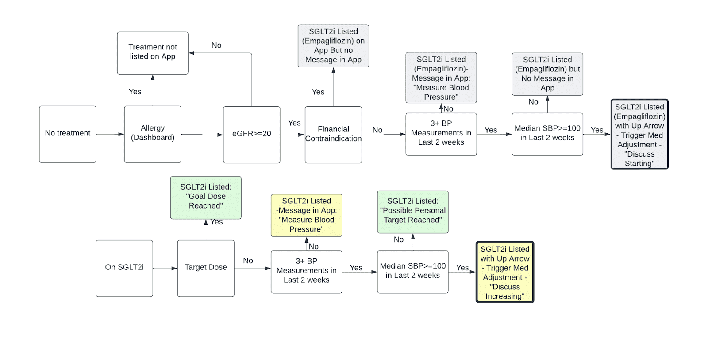

<!-- 
This source file is part of the ENGAGE-HF project based on the Stanford Spezi Template Application project 
SPDX-FileCopyrightText: 2023 Stanford University
SPDX-License-Identifier: MIT 
-->

# ENGAGE-HF Firebase

[](https://github.com/StanfordBDHG/ENGAGE-HF-Firebase/actions/workflows/build-and-test.yml)
[](https://github.com/StanfordBDHG/ENGAGE-HF-Firebase/actions/workflows/deployment.yml)


Firebase cloud hosting infrastructure for the ENGAGE-HF project.

## Behavior

The base functionality of the ENGAGE-HF Firebase Functions revolve around three parts:
- recommending medication changes to patients based on existing medication, vitals and symptom scores
- calculating symptom scores from questionnaire responses of patients
- generating Health Summary PDFs containing recommendations, vitals and symptom scores

## Usage

To use Firebase functions for your own project or to emulate them for client applications, this section will help to give an overview of the different packages in use and how to install, build, test and launch them.

This repository contains two separate packages.

- The package located in [functions/models](functions/models) contains model types including decoding/encoding functions and useful extensions that are shared between the Firebase functions and the web dashboard. This package is released via the npm registry and can be accessed as `@stanfordbdhg/engagehf-models`.
- The package located in [functions](functions) contains the Firebase functions and services that are called from these functions. This package has a local dependency on the package in [functions/models](functions/models). Therefore, the functions package does not work (e.g. for linting, building, etc) without building the models package first.

To make this structure simpler to use, we provide different scripts as part of the [package.json](package.json) file in the root directory of this repository. The file ensures execution order between the two packages. We only document the scripts located in this file, since they cover the most common use cases, feel free to have a look at the individual package.json files of the respective packages to get a deeper understanding and more package-focused operations.

|Command|Purpose|
|-|-|
|npm run install|Installs dependencies (incl. dev dependencies) for both packages.|
|npm run clean|Cleans existing build artifacts for both packages.|
|npm run build|Builds both packages. If you have added or removed files in one of the packages, make sure to clean before using this command.|
|npm run lint|Lints both packages. Make sure to build before using this command. You may want to append `:fix` to fix existing issues automatically or `:strict` to make sure the command does not succeed with existing warnings or errors.|
|npm run prepare|Combines cleaning, installing and building both packages.|
|npm run test:ci|Tests the Firebase functions with emulators running and with test coverage collection active.|
|npm run serve:seeded|Starts up the relevant emulators for ENGAGE-HF and seeds them. Make sure to build the project first before executing this command.|

For using the emulators for client applications, it is probably easiest to call `npm run prepare` whenever files could have changed (e.g. when changing branch or pulling new changes) and then calling `npm run serve:seeded` to start up the emulators in a seeded state. Both of these commands are performed in the root directory of this repository.

Otherwise, you may want to use Docker to run the emulators.  For this, you can use the following command:

```bash
docker-compose up
```

This can be especially useful if you're using an operating system like Windows, as scripts contain OS-specific commands that may not work the same way across different platforms.

### Single sign-on (SSO) Setup

The ENGAGE-HF web frontend uses single sign on (SSO) as a mechanism to allow clinicians and admins to log into the web page.

For a Stanford deployment, the [Stanford SAML and OIDC Configuration Manager](https://spdb-prod.iam.stanford.edu) needs to be configured using an OIDC configuration.
Other sites can obtain the OpenID Connect (OIDC) from other sites following a similiar setup.
You will use the Client ID and Client secret from the configuration to set up the OIDC authentication in Firebase Authentication.

- Subject Type: `public`
- Token Endpoint Auth: `client_secret_basic`
- Grant Type: `refresh_token (authorization_code always enabled)`
- Scopes: `profile`, `email`.
- Redirect URI(s): `https://FIREBASE_PROJECT_ID.firebaseapp.com/__/auth/handler`, replacing `FIREBASE_PROJECT_ID` with your Firebase project identifier.
- Disable PKCE: `true`. This needs to be set as [Firebase doesn't support Proof Key for Code Exchange (PKCE) at this moment](https://github.com/firebase/firebase-js-sdk/issues/5935).

You will need to configure [Firebase Authentication with Identity Platform to use OpenID connect in web apps](https://firebase.google.com/docs/auth/web/openid-connect).
You need to configure the OpenID Connect Sign-in provider as follows:

- Grant Type: `Code flow`
- Name: e.g., `Stanford` (or the name of the other institutions)
- Client ID: Client ID obtained from your OIDC configuration from the [Stanford SAML and OIDC Configuration Manager](https://spdb-prod.iam.stanford.edu).
- Issuer (URL): e.g., `https://login.stanford.edu` (or the issues URL from the other institution)
- Client secret: Client ID obtained from your OIDC configuration from the [Stanford SAML and OIDC Configuration Manager](https://spdb-prod.iam.stanford.edu).

### Health Summary Generation

Health Summary PDFs contain four sections:
- Medications & Recommendations
- Vital Summary containing only the most important vitals
- Symptom Score Report including a speedometer displaying the current score in relation to the previous one and a baseline, a table with the most recent symptom score results and a small personal summary
- Detailed Vitals Page with graphs displaying body weight, heart rate and blood pressure measurements and important key figures

### Recommendation Algorithms

ENGAGE-HF uses four different algorithms to recommend medication changes based on existing medication, vitals and symptom scores. Each recommendation algorithm corresponds to a medication class (Beta blockers, MRA, SGLT2i) or a group of medication classes (RASI including ACEI, ARB and ARNI).

- Note 1: This codebase contains five different recommender types, including one for diuretics. The diurectics recommender simply recommends staying on the existing medication and assumes that medication to already be at the personal target dose.
- Note 2: The algorithms are only expected to be run with one medication per class, not multiple different medications in one class.

ENGAGE-HF utilizes four algorithms to recommend medication adjustments based on a patient's current medications, vital signs, and symptom scores. Each algorithm is tailored to a specific medication class — Beta-blockers, MRAs, and SGLT2 inhibitors — or a combination of classes, such as RASI (including ACEIs, ARBs, and ARNIs).

Notes:

- The codebase includes an additional recommender for diuretics, making a total of five recommenders. The diuretics recommender simply advises maintaining the current medication, assuming it is already at the patient’s personal target dose.
- The algorithms are designed to handle one medication per class, not multiple medications within the same class.

#### Beta Blockers


Depending on contraindications entered on the Web Dashboard, a different medication is listed in the following order:
- Carvedilol
- Metoprolol Succinate
- Bisoprolol

#### RASI


#### MRA


Depending on contraindications entered on the Web Dashboard, a different medication is listed in the following order:
- Spironolactone
- Eplerenone

#### SGLT2i



Depending on contraindications entered on the Web Dashboard, a different medication is listed in the following order:
- Empagliflozin
- Dapagliflozin
- Sotagliflozin

#### Contraindications

Contraindications are handled using FHIR AllergyIntolerance resources found in the users/$userId$/allergyIntolerances collections. In the `code` property, we use RxNorm codes as described in [functions/src/tests/resources/contraindications.csv](functions/src/tests/resources/contraindications.csv) for the different medications. Depending on the `type` and `criticality` properties, we identify each allergy as one of the following:

- Severe Allergy (for type `allergy` and criticality `high`)
- Allergy (for type `allergy` and criticality not `high`)
- Intolerance (for type `intolerance`)
- Financial (for non-standard type `financial`)

In [the file](functions/src/tests/resources/contraindications.csv), we also describe how each of these cases relate to which medications are taken out of the recommendable options.

### Symptom Score Calculation

The Kansas City Cardiomyopathy Questionnaire-12 (KCCQ-12) score assesses a patient’s physical limitations, symptom frequency, quality of life, and social limitations. Scores are normalized to a 0-100 scale, where higher values indicate better health status. ENGAGE-HF further adds one additional question about dizziness to the questionnaire used in the application.

#### Physical Limitations

Questions 1a, 1b, and 1c assess physical limitations. Responses are scored from 1 to 6, where:
- 1 indicates severe limitations.
- 5 indicates minimal limitations.
- 6 indicates "Does not apply" (excluded from scoring).

The Physical Limitations score is the average of the applicable responses, normalized to a 0-100 scale. If fewer than two responses are valid, the score cannot be calculated.

#### Symptom Frequency

Questions 2, 3, 4, and 5 evaluate symptom frequency, with responses scored from:
- 1 to 4 for Questions 2 and 5.
- 1 to 7 for Questions 3 and 4.

Each response is normalized to a 0-100 scale. The Symptom Frequency score is the average of these normalized values.

#### Quality of Life

Questions 6 and 7 measure quality of life, with responses scored from 1 to 4, where lower scores indicate worse quality of life. These scores are normalized to a 0-100 scale, and their average forms the Quality of Life score.

#### Social Limitations

Questions 8a, 8b, and 8c address social limitations, scored similarly to the Physical Limitations questions (1 to 6 scale, excluding "Does not apply"). The Social Limitations score is the average of the applicable responses, normalized to 0-100, provided at least two valid responses are available.

#### Clinical Summary & Overall

The Clinical Summary Score is the average of the Physical Limitations and Symptom Frequency scores, whereas the Overall Total Score is calculated as the average of all four above-mentioned domain scores.

#### Dizziness

In addition to the KCCQ-12 questions, ENGAGE-HF uses question 9 to ask the patient about dizziness. Its responses are encoded as integers between 1 and 5.

## Data Scheme

This document describes how data is stored in Firestore for the Engage-HF app.

### Custom Types

The following section describes custom types defined for this system to be later used

#### LocalizedText

A LocalizedText object shall be used whenever text requires localization or may require in the future. The object may either simply be a single string (in the case of localizations not being available yet) or a dictionary with string keys and string values. If LocalizedText is represented by a string-string dictionary, the keys represent language-codes following the ISO 639-1 (or if necessary ISO 639-2) standard and the respective text in the given language as value.

Some localizations may require to include regions as well (e.g. Australian/British/American English), so the clients should be aware of this and prioritize the language code with the correct region (`en-us`) over the general code (`en`), if it is present.

A LocalizedText object cannot be used in FHIR-conforming types due to its incompatibility with the standard. FHIR types commonly contain text in one language only to be specified using the `language` property.

##### Example

```
{
	"en":"Welcome to the Engage-HF app!",
	"de":"Willkommen in der Engage-HF App!",
	"es":"¡Bienvenido a la aplicación Engage-HF!"
}
```

### Invitations

#### invitations/$invitationId$

When a user joins Engage-HF, we first create an invitation code on demand of an operator of the web dashboard. 

For patients, upon entering the invitation code using an anonymous login, the userId is set. After successful registration, the user object will be fully created and the invitation is removed from this collection.

For SSO users (e.g. clinicians,owners), upon the first login using SSO, the related invitation is fetched, the user object will be fully created and the invitation is removed from this collection.

|Property|Type|Values|Comments|
|-|-|-|-|
|code|string|e.g. 'PAULPAUL'|An 8-digit invitation code or SSO email address.|
|userId|optional string|-|The userId associated with the invitation. This is set when an anonymous user has entered an invitation code, but has not used a proper account to log in yet.|
|auth|optional Auth|Authentication information to be set when redeeming invitation. Will no longer be set once invitation has been redeemed.|
|auth>displayName|optional string|Display name for the user.|
|auth>email|optional string|E-Mail address of the user.|
|auth>phoneNumber|optional string|Phone number of the user.|
|auth>photoURL|optional string|URL for a photo of the user.|
|user|optional User|See users/$userId$ for full specification. Will no longer be set once invitation has been redeemed.|

### Medications

In this section, we describe information regarding all the medications to be specified in the Engage-HF context. These medications may be used by a clinician for medication requests to a patient (users/$userId$/medicationRequests) or contra-indications (users/$userId$/allergyIntolerances). The medications are generated from [functions/data/medicationCodes.json](functions/data/medicationCodes.json) file containing medications (incl. respective RxNorm SCD type codes) grouped by medication classes.

#### medications/$medicationId$

Based on [FHIR Medication](https://hl7.org/fhir/R4B/medication.html), the following properties may be used, while additional properties are ignored by the Engage-HF system.

|Property|Type|Values|Comments|
|-|-|-|-|
|id|string|-|[Resource](https://hl7.org/fhir/R4B/resource.html): Logical id of this artifact|
|code|FHIRCodeableConcept|-|FHIRCodeableConcept containing an RxNorm code of the IN/MIN type, a display name and the RxNorm system url.|
|extension|list of Extension|-|See /medications/$medicationId$/extension for possible values|

Based on the [Extension](https://hl7.org/fhir/R4B/extensibility.html#Extension) format specified in FHIR, a medication may contain a list of these following extension properties. Each property will need to get a url assigned to fit the FHIR data format.

|Property|Type|Values|Comments|
|-|-|-|-|
|medicationClass|string|-|A `medicationClassId` referring to a medicationClass specified in /medicationClasses/$medicationClassId$. One medication object may contain multiple medicationClass extension properties.|
|minimumDailyDose|[SimpleQuantity](https://www.hl7.org/fhir/r4b/datatypes.html#SimpleQuantity)|-|Unit: mg/day. Occurs exactly once. Multi-ingredient tablets contain an array of double rather than a double.|
|targetDailyDose|[SimpleQuantity](https://www.hl7.org/fhir/r4b/datatypes.html#SimpleQuantity)|-|Unit: mg/day. Occurs exactly once. Multi-ingredient tablets contain an array of double rather than a double.|

#### medications/$medicationId$/drugs/$drugId$

|Property|Type|Values|Comments|
|-|-|-|-|
|id|string|-|[Resource](https://hl7.org/fhir/R4B/resource.html): Logical id of this artifact|
|code|FHIRCodeableConcept|-|FHIRCodeableConcept containing an RxNorm code of the SCD type, a display name and the RxNorm system url.|
|ingredient|list of Ingredient|-|Use references to medications and strength for quantity information.|
|ingredient[x]>itemCodeableConcept|FHIRCodeableConcept|-|FHIRCodeableConcept containing an RxNorm code of the IN type, a display name and the RxNorm system url.|
|ingredient[x]>strength|Ratio|-|Uses "mg" as numerator unit, no denominator unit and denominator value is always 1.|

#### medicationClasses/$medicationClassId$

|Property|Type|Values|Comments|
|-|-|-|-|
|id|string|-|-|
|name|LocalizedText|-|A name for a given medicationClass to be displayed to a user.|
|videoPath|string|e.g. "/videoSectionId/1/videos/2"|The path to retrieve the respective video from Firestore.|

### Organizations

#### organizations/$organizationId$

|Property|Type|Values|Comments|
|-|-|-|-|
|name|string|e.g. "Stanford University"|-|
|contactName|string|e.g. "Alex Sandhu, MD"|-|
|phoneNumber|string|e.g. "(650) 493-5000"|-|
|emailAddress|string|e.g. "dothfteam@stanford.edu"|-|
|ssoProviderId|string|-|The providerId as used for single sign-on.|

### Questionnaires

In this section, we describe all the information stored for questionnaires.

#### questionnaires/$questionnaireId$

Based on [FHIR Questionnaire](https://hl7.org/fhir/R4B/questionnaire.html), the following properties may be used, while additional properties are ignored by the Engage-HF system.

|Property|Type|Values|Comments|
|-|-|-|-|
|id|string|-|[Resource](https://hl7.org/fhir/R4B/resource.html): Logical id of this artifact|
|meta|Meta|-|[Resource](https://hl7.org/fhir/R4B/resource.html#Meta): Metadata about the resource|
|identifier|list of Identifier|-|Business identifier for this questionnaire. There may be multiple questionnaire objects in this list, with differing `id` and `language` properties, but a common business identifier.|
|title|string|-|Human-friendly title of the questionnaire.|
|date|Date|-|last modified date|
|version|string|-|Business version of the questionnaire.|
|language|optional string|e.g. "en"|Following IETF BCP-47 / [FHIR ValueSet languages](https://hl7.org/fhir/R4B/valueset-languages.html)|
|item|list of BackboneElement|-|items as defined in [FHIR Questionnaire](https://hl7.org/fhir/R4B/questionnaire.html)|
|item[x]>linkId|string|-|Unique id for item in questionnaire|
|item[x]>definition|optional uri|-|Details for the item|
|item[x]>prefix|optional string|e.g. "1(a)", "2.5.3"|Prefix of the item that isn't actually part of the name but may still be displayed.|
|item[x]>text|string|-|Primary text for the item|
|item[x]>type|code|e.g. "group", "display", "boolean", "decimal", "integer", "date", etc|See [QuestionnaireItemType](https://hl7.org/fhir/R4B/valueset-item-type.html) for available values.|

You can find an example KCCQ-12 questionnaire in [functions/data/questionnaires.json](functions/data/questionnaires.json).

### Users

#### users/$userId$

In this section, we describe all user-related data to be stored. The security rules shall be set up in a way to only allow for a patient to access its own information and a clinician to access all patients' information (or even more restrictive, if needed).

|Property|Type|Values|Comments|
|-|-|-|-|
|type|string|e.g. "admin", "owners", "clinician", "patient"|The type of the user.|
|disabled|optional boolean|If set to `true`, the users looses permission to perform any action except reading its own data stored in `users/$userId$`.|
|dateOfEnrollment|Date|-|The date when the invitation code was used to create this user.|
|dateOfBirth|optional Date|-|The date when the user was born.|
|genderIdentity|optional string|"female","male","transgender","nonBinary","preferNotToState"|The gender identity chosen when a patient redeemed the invitation.|
|organization|optional string|-|The id of the organization a clinician, patient or owner is associated with.|
|invitationCode|string|-|The invitationCode to be used when logging in to the app for the first time.|
|language|optional string|e.g. "en"|Following IETF BCP-47 / [FHIR ValueSet languages](https://hl7.org/fhir/R4B/valueset-languages.html).|
|receivesAppointmentReminders|optional boolean|true, false|Decides whether to send out appointment reminders one day before each appointment.|
|receivesInactivityReminders|optional boolean|true, false|Decides whether to send updates about inactivity.|
|receivesMedicationUpdates|optional boolean|true, false|Decides whether to send updates about current medication changes.|
|receivesQuestionnaireReminders|optional boolean|true, false|Decides whether to send reminders about filling out their questionnaire every 14 days.|
|receivesRecommendationUpdates|optional boolean|true, false|Decides whether to send updates about recommended medication changes.|
|receivesVitalsReminders|optional boolean|true, false|Decides whether to send reminders about measuring vitals.|
|receivesWeightAlerts|optional boolean|true, false|Decides whether to send out alerts when drastic weight changes are observed.|
|timeZone|string|e.g. "America/Los_Angeles"|The value needs to correspond to an identifier from [TZDB](https://nodatime.org/TimeZones). It must not be an offset to UTC/GMT, since that wouldn't work well with daylight-savings (even if there is no daylight-savings time at that location). Also, don't use common abbreviations like PST, PDT, CEST, etc (they may be ambiguous, e.g. CST). If the timeZone is unknown, then "America/Los_Angeles" should be used.|

#### users/$userId$/devices/$deviceId$

This data is required to send push notifications over the [Firebase Cloud Messaging](https://firebase.google.com/docs/cloud-messaging) System.

|Property|Type|Values|Comments|
|-|-|-|-|
|modifiedDate|Date|-|This date is updated whenever the token is sent to the server, even if it is not replaced by a different token. It simply reflects the last date we can definitely confirm the token was active. Idea: We may ignore some devices, if the token has not been updated for a long time, since the app has not been opened for a long time.|
|notificationToken|string|-|The FCM token as received from Firebase in the app.|
|platform|optional string|e.g. "iOS", "Android"|This information is important as context for the `osVersion`, `appVersion` and `appBuild` properties.|
|osVersion|optional string|e.g. "17.5.1"|The version of the OS. Depending on the OS, they may have different formats to be specified separately.|
|appVersion|optional string|e.g. "1.0.1"|The version of the app as it is specified on the App/Play Store.|
|appBuild|optional string|e.g. "56"|The build version of the app as defined by the CI pipeline releasing the app.|
|language|optional string|e.g. "en"|Following IETF BCP-47 / [FHIR ValueSet languages](https://hl7.org/fhir/R4B/valueset-languages.html)|

Push notifications over APNS / FCM only contain text in a single language. For this, the device's `language` property shall be prioritized, falling back on the user's `language` property and using US-English if both are not present.

##### Adding a new device or modifying information of an existing one

A device can only be identified by its notification token. When updating a device's information, we therefore check if the notification token already exists in Firestore. If it already exists, we update all other existing fields' values - otherwise, we create a new device.

A device may receive a different notification token at any time though. Therefore, we might create a new device, even though that device already exists in the table with a different (now inactive) notification token. Therefore, every time we send out a new notification and receive the information that a token is no longer active, we need to remove the device from this table.

#### users/$userId$/allergyIntolerances/$allergyIntoleranceId$

Only users with a `patient` role assigned have values in this collection.

Based on [FHIR AllergyIntolerance](https://hl7.org/fhir/R4B/allergyintolerance.html), the following properties may be used, while additional properties are ignored by the Engage-HF system.

|Property|Type|Values|Comments|
|-|-|-|-|
|id|string|-|[Resource](https://hl7.org/fhir/R4B/resource.html): Logical id of this artifact|
|type|optional [allergyIntoleranceType](https://hl7.org/fhir/R4B/valueset-allergy-intolerance-type.html)|e.g. "allergy", "intolerance"|In addition to the FHIR defined value set, we also use "financial" - these values shall not be exposed to EHR systems.|
|code|CodableContent|e.g. `{"coding":[{"system":"https://hl7.org/fhir/R4B/valueset-allergyintolerance-code.html","code":"293963004","display":"Cardioselective beta-blocker allergy"}],"text":"Cardioselective beta-blocker allergy"}`|Uses either [AllergyIntoleranceCode](https://hl7.org/fhir/R4B/valueset-allergyintolerance-code.html), `medicationId` as used in /medications/$medicationId$ and/or `medicationId` as used in /medicationClasses/$medicationClassId$.|
|patient|string|-|`userId` as used in /users/$userId$ and related collections.|

We use RxNorm codes to identify contraindications using the following rules:

|Class|Medication|If allergy, not eligible for|If allergy with reaction type angioedema not eligible for|If intolerance not eligible for|If intolerance default to|If financial, not eligible for|
|-|-|-|-|-|-|-|
|BB|Metoprolol succinate ER|BB|BB|Metoprolol|Carvedilol|BB|
|BB|Carvedilol|BB|BB|Carvedilol|Metoprolol succinate|BB|
|BB|Carvedilol phosphate ER|BB|BB|Carvedilol|Metoprolol succinate|BB|
|BB|Bisoprolol|BB|BB|Bisoprolol|Carvedilol|BB|
|SGLT|Dapagliflozin|SGLT|SGLT|Dapagliflozin|Empagliflozin|SGLT|
|SGLT|Empagliflozin|SGLT|SGLT|Empagliflozin|Dapagliflozin|SGLT|
|SGLT|Sotagliflozin|SGLT|SGLT|Sotagliflozin|Empagliflozin|SGLT|
|SGLT|Bexagliflozin|SGLT|SGLT|Bexagliflozin|Empagliflozin|SGLT|
|SGLT|Canagliflozin|SGLT|SGLT|Canagliflozin|Empagliflozin|SGLT|
|SGLT|Ertugliflozin|SGLT|SGLT|Ertugliflozin|Empagliflozin|SGLT|
|MRA|Spironolactone|MRA|MRA|Spironolactone|Eplerenone|MRA|
|MRA|Eplerenone|MRA|MRA|Eplerenone|Spironolactone|MRA|
|ACE|Quinapril|ACEI|ACEI/ARB/ARNI|ACEI|Valsartan/ARNI|ACEI/ARB/ARNI|
|ACE|Perindopril|ACEI|ACEI/ARB/ARNI|ACEI|Valsartan/ARNI|ACEI/ARB/ARNI|
|ACE|Ramipril|ACEI|ACEI/ARB/ARNI|ACEI|Valsartan/ARNI|ACEI/ARB/ARNI|
|ACE|Benazepril|ACEI|ACEI/ARB/ARNI|ACEI|Valsartan/ARNI|ACEI/ARB/ARNI|
|ACE|Captopril|ACEI|ACEI/ARB/ARNI|ACEI|Valsartan/ARNI|ACEI/ARB/ARNI|
|ACE|Enalapril|ACEI|ACEI/ARB/ARNI|ACEI|Valsartan/ARNI|ACEI/ARB/ARNI|
|ACE|Lisinopril|ACEI|ACEI/ARB/ARNI|ACEI|Valsartan/ARNI|ACEI/ARB/ARNI|
|ACE|Fosinopril|ACEI|ACEI/ARB/ARNI|ACEI|Valsartan/ARNI|ACEI/ARB/ARNI|
|ACE|Trandolapril|ACEI|ACEI/ARB/ARNI|ACEI|Valsartan/ARNI|ACEI/ARB/ARNI|
|ACE|Moexepril|ACEI|ACEI/ARB/ARNI|ACEI|Valsartan/ARNI|ACEI/ARB/ARNI|
|ARB|Losartan|ARB/ARNI|ACEI/ARB/ARNI|ARB/ARNI|Lisinopril|ACEI/ARB/ARNI|
|ARB|Valsartan|ARB/ARNI|ACEI/ARB/ARNI|ARB/ARNI|Lisinopril|ACEI/ARB/ARNI|
|ARB|Candesartan|ARB/ARNI|ACEI/ARB/ARNI|ARB/ARNI|Lisinopril|ACEI/ARB/ARNI|
|ARB|Irbesartan|ARB/ARNI|ACEI/ARB/ARNI|ARB/ARNI|Lisinopril|ACEI/ARB/ARNI|
|ARB|Telmisartan|ARB/ARNI|ACEI/ARB/ARNI|ARB/ARNI|Lisinopril|ACEI/ARB/ARNI|
|ARB|Olmesartan|ARB/ARNI|ACEI/ARB/ARNI|ARB/ARNI|Lisinopril|ACEI/ARB/ARNI|
|ARB|Azilsartan|ARB/ARNI|ACEI/ARB/ARNI|ARB/ARNI|Lisinopril|ACEI/ARB/ARNI|
|ARB|Eprosartan|ARB/ARNI|ACEI/ARB/ARNI|ARB/ARNI|Lisinopril|ACEI/ARB/ARNI|
|ARNI|Sacubitril-Valsartan|ARB/ARNI|ACEI/ARB/ARNI|ARNI|Valsartan|ARNI|
|Diuretic|Furosemide|-|-|-|-|-|
|Diuretic|Bumetanide|-|-|-|-|-|
|Diuretic|Torsemide|-|-|-|-|-|
|Diuretic|Ethacrynic Acid|-|-|-|-|-|

#### users/$userId$/appointments

Only users with a `patient` role assigned have values in this collection. There is currently no easy way to check for appointments relevant to one clinician - if it happens to be a requirement in the future, we may need to restructure this.

Based on [FHIR Appointment](https://hl7.org/fhir/R4B/appointment.html), the following properties may be used, while additional properties are ignored by the Engage-HF system.

|Property|Type|Values|Comments|
|-|-|-|-|
|status|[AppointmentStatus](https://hl7.org/fhir/R4B/valueset-appointmentstatus.html)|e.g. "booked"|-|
|created|Date||
|start|[Instant](https://hl7.org/fhir/R4B/datatypes.html#instant)|-|-|
|end|[Instant](https://hl7.org/fhir/R4B/datatypes.html#instant)|-|-|
|comment|optional string|-|May not be shown to the patient.|
|patientInstruction|optional string|-|May be shown to the patient.|
|participant|list of CodeableConcept|-|Must contain at least one element.|
|participant[x]>actor|Reference(User)|e.g. `users/123`|The Firestore path to the patient.|
|participant[x]>status|[ParticipationStatus](https://hl7.org/fhir/R4B/valueset-participationstatus.html)|e.g. accepted, declined, tentative, needs-action|-|

#### users/$userId$/medicationRequests/$medicationRequestId$

Only users with a `patient` role assigned have values in this collection.

Based on [FHIR MedicationRequest](https://hl7.org/fhir/R4B/medicationrequest.html), the following properties may be used, while additional properties are ignored by the Engage-HF system. Clients may ignore this list and simply query for users/$userId$/medicationRecommendations and retrieve the relevant requests from the recommendations.

|Property|Type|Values|Comments|
|-|-|-|-|
|id|string|-|[Resource](https://hl7.org/fhir/R4B/resource.html): Logical id of this artifact|
|medication|Reference(Medication) or CodeableConcept|-|CodeableConcept containing one of the codes from /medications/$medicationId$|
|dosageInstruction|Dosage|-|-|

The `dosageInstruction` property may contain values with the following properties:

|Property|Type|Values|Comments|
|-|-|-|-|
|id|string|-|[Resource](https://hl7.org/fhir/R4B/resource.html): Logical id of this artifact|
|text|optional string|-|Free text dosage instructions|
|additionalInstruction|list of CodableConcept|information like "with meals", "may cause drowsiness", etc|Supplemental instruction or warnings to the patient|
|patientInstruction|optional string|-|Patient or consumer oriented instructions|
|timing|optional [Timing](https://hl7.org/fhir/R4B/datatypes.html#timing)|-|When medication should be administered|
|doseAndRate|list of Element|-|Amount of medication administered|
|doseAndRate>type|optional [DoseRateType](https://hl7.org/fhir/R4B/codesystem-dose-rate-type.html)|e.g. "calculated", "ordered"||
|doseAndRate>dose|optional [SimpleQuantity](https://hl7.org/fhir/R4B/datatypes.html#SimpleQuantity)|-|Unit is always "tablet". Value is usually 0.5, 1 or 2.|
|maxDosePerPeriod|optional [Ratio](https://hl7.org/fhir/R4B/datatypes.html#ratio)|-|Upper limit on medication per unit of time|
|maxDosePerAdministration|optional [SimpleQuantity](https://hl7.org/fhir/R4B/datatypes.html#SimpleQuantity)|-|Upper limit on medication per administration|
|maxDosePerLifetime|optional [SimpleQuantity](https://hl7.org/fhir/R4B/datatypes.html#SimpleQuantity)|-|Upper limit on medication per unit of time|

There may be up to three intakes per day (morning, mid-day and evening) with either 0.5, 1 or 2 tablets. The dosages should always be grouped by medication, i.e. there should not be multiple medication elements concerning the same medication but different dosage instructions. Instead, one medication element shall be used for that medication with multiple dosage instructions.

#### users/$userId$/medicationRecommendations/$medicationRecommendationId$

Only users with a `patient` role assigned have values in this collection.

These are the output values of the recommendation algorithms. Depending on the type, the recommendations should be displayed with different icons and texts.

|Property|Type|Values|Comments|
|-|-|-|-|
|currentMedication|optional Reference(FHIRMedicationRequest)|e.g. `{"reference":"users/123/medicationRequest/2"}`|Reference to the existing medication request, if applicable.|
|recommendedMedication|optional Reference(FHIRMedication)|e.g. `{"reference":"medications/2"}`|Reference to the recommended medication, if applicable. This should always direct to a medication, not a drug.|
|displayInformation|DisplayInformation|-|The information necessary for the client to display the medication recommendation.|

##### Medication Recommendation Type

|Type|Icon|Current Medication|Recommended Medication|Comments|
|-|-|-|-|-|
|targetDoseReached|Green Checkmark|exists|undefined|The target dose has been reached.|
|personalTargetDoseReached|Green Checkmark|exists|undefined|The personal target dose has been reached, meaning that vitals signal that we should not increase the dose (yet).|
|improvementAvailable|Yellow Up Arrow|exists|undefined|The patient should uptitrate.|
|morePatientObservationsRequired|Yellow|maybe|maybe (mutually exclusive to current medication)|There are not enough patient observations to recommend anything. They should probably do some blood pressure measuring.|
|moreLabObservationsRequired|Yellow|maybe|maybe (mutually exclusive to current medication)|More lab observations are required to recommend anything. The patient should probably schedule an appointment with a clinician.|
|notStarted|Gray Up Arrow|undefined|exists|Medication has not been started, but is eligible for initiation.|
|noActionRequired|Gray|undefined|exists|The recommended medication is not eligible, but should still be shown to the user as an option without recommending it to them.|

Diuretics, if currently present as medication request, will be shown as a recommendation with `personalTargetDoseReached`, so that the logic on the client becomes easier.

##### DisplayInformation

|Property|Type|Values|Comments|
|-|-|-|-|
|title|LocalizedText|e.g. "Carvedilol"|The name of the medication (not the tablet), e.g. coming from `medications/1998`.|
|subtitle|LocalizedText|e.g. "Beta Blockers"|The medication class name, e.g. coming from `medicationClasses/0`.|
|description|LocalizedText|e.g. "Personal target dose reached. No action required."|The explanation of the recommendation, displayed along with a summary of the medication.|
|type|[Medication Recommendation Type](#Medication-Recommendation-Type)|e.g. "personalTargetDoseReached"|See [Medication Recommendation Type](#Medication-Recommendation-Type) for more information.|
|videoPath|optional string|e.g. `videoSections/1/videos/3`|This is the video to show when the recommendation is tapped. The clients may want to hide the icon to get to the video when this value is not present.|
|dosageInformation|DosageInformation|See [Dosage Information](#Dosage-Information)|A description of the current, minimum, and target doses for a given medication. 
When the patient is not yet taking the medication, its currentSchedule will be an empty list.|

The `DosageInformation` property contains the following information:

|Property|Type|Values|Comments|
|-|-|-|-|
|currentSchedule|list of DoseSchedule|e.g. \[25mg twice daily, 10mg daily\]|A list tracking how many times per day the patient currently takes each tablet.|
|minimumSchedule|list of DoseSchedule|e.g. \[6.25mg daily\]|A list tracking how many times per day the patient would take each tablet on a minimal dose.|
|targetSchedule|list of DoseSchedule|e.g. \[6.25mg daily\]|A list tracking how many times per day the patient would take each tablet on a maximal dose.|
|unit|string|e.g. "mg"|The unit by which the ingredients in the medications are measured, as found in `medications/$medicationId$/drugs/$drugId$`.|

The `DoseSchedule` object describes the number of tablets taken per day for a single medication as described in `medications/$medicationId$/drugs/$drugId$`. For example, taking two 5mg tablets in the morning and one 15mg tablet in the afternoon would result in two schedules: 5mg twice daily, and 15mg daily. Compound (multi-ingredient) tablets have multiple quantities per tablet, and will be displayed as e.g. 24/26mg twice daily. `DoseSchedule` has the following properties:

|Property|Type|Values|Comments|
|-|-|-|-|
|frequency|number|e.g. 1, 2, or 0.5|The number of tablets per day (as described by `medicationRequests/$medicationRequestId$/dosageInstruction`).|
|quantity|list of number|e.g. \[24, 26\] or \[6.25\]|The amount of each active ingredient per tablet.|

### Observations

Only users with a `patient` role assigned have values in these collections.

We are storing different observations grouped by their type, e.g. we use /users/$userId$/bodyWeightObservations/$observationId$ for body weight observations and /users/$userId$/bloodPressureObservations/$observationId$ for blood pressure observations. The different collections are all listed below and they follow the specification of a FHIR observation as defined here with more strict specification following in the respective subsections.

Based on [FHIR Observation](https://hl7.org/fhir/R4B/observation.html), the following properties may be used, while additional properties are ignored by the Engage-HF system.

|Property|Type|Values|Comments|
|-|-|-|-|
|id|string|-|[Resource](https://hl7.org/fhir/R4B/resource.html): Logical id of this artifact|
|status|[ObservationStatus](https://hl7.org/fhir/R4B/valueset-observation-status.html)|e.g. "final"|This value is most likely "final" in every case.|
|code|[Code](https://hl7.org/fhir/R4B/valueset-observation-codes.html)|e.g. `{"system":"http://loinc.org","code":"55423-8","display":"Number of steps"}`|Use one of the codes mentioned below.|
|value|optional [Quantity](https://hl7.org/fhir/R4B/datatypes.html#Quantity)|e.g. `{"code":"mm[Hg]","system":"http://unitsofmeasure.org","unit":"mmHg","value":120}`|Use one of the units listed below.|
|component|list of components|-|Instead of containing a single `value` property, some observations are composed of multiple components (e.g. a blood pressure observation contains a diastolic and systolic component).|
|component[x]>code|[Code](https://hl7.org/fhir/R4B/valueset-observation-codes.html)|e.g. `{"system":"http://loinc.org","code":"55423-8","display":"Number of steps"}`|Use one of the codes mentioned below.|
|component[x]>value|optional [Quantity](https://hl7.org/fhir/R4B/datatypes.html#Quantity)|e.g. `{"code":"mm[Hg]","system":"http://unitsofmeasure.org","unit":"mmHg","value":120}`|Use one of the units listed below.|
|effective|[Period](https://hl7.org/fhir/R4B/datatypes.html#period) with Date objects or Date|-|Use Date for instant observation and periods for longer observations (e.g. more than 1 minute).|

#### users/$userId$/bloodPressureObservations/$observationId$

Blood pressure observations contain the following code and no value.

|code>system|code>code|code>display|
|-|-|-|
|"https://loinc.org"|"85354-9"|"Blood pressure panel with all children optional"|

Further, blood pressure observations have two components.

|code>system|code>code|code>display|value>system|value>value|value>code|value>unit|
|-|-|-|-|-|-|-|
|"http://loinc.org"|"8462-4"|"Diastolic blood pressure"|"http://unitsofmeasure.org"|double|"mm[Hg]"|"mmHg"|
|"http://loinc.org"|"8480-6"|"Systolic blood pressure"|"http://unitsofmeasure.org"|double|"mm[Hg]"|"mmHg"|

#### users/$userId$/bodyWeightObservations/$observationId$

Body weight observations contain the following code and value.

|code>system|code>code|code>display|value>system|value>value|value>code|value>unit|
|-|-|-|-|-|-|-|
|"http://loinc.org"|"29463-7"|"Body weight"|double|"http://unitsofmeasure.org"|"kg" or "[lb_av]"|"kg" or "lbs"|

#### users/$userId$/creatinineObservations/$observationId$

Creatinine observations contain the following code and value.

|code>system|code>code|code>display|value>system|value>value|value>code|value>unit|
|-|-|-|-|-|-|-|
|"http://loinc.org"|"2160-0"|"Creatinine [Mass/volume] in Serum or Plasma"|double|"http://unitsofmeasure.org"|"mg/dL"|"mg/dL"|

#### users/$userId$/dryBodyWeightObservations/$observationId$

Dry body weight observations contain the following code and value.

|code>system|code>code|code>display|value>system|value>value|value>code|value>unit|
|-|-|-|-|-|-|-|
|"http://loinc.org"|"29463-7"|"Body weight"|double|"http://unitsofmeasure.org"|"kg"|"kg"|

#### users/$userId$/eGfrObservations/$observationId$

Dry body weight observations contain the following code and value.

|code>system|code>code|code>display|value>system|value>value|value>code|value>unit|
|-|-|-|-|-|-|-|
|"http://loinc.org"|"98979-8"|"Glomerular filtration rate/1.73 sq M.predicted [Volume Rate/Area] in Serum, Plasma or Blood by Creatinine-based formula (CKD-EPI 2021)"|double|"http://unitsofmeasure.org"|"mL/min/{1.73_m2}"|"mL/min/1.73_m2"|

#### users/$userId$/heartRateObservations/$observationId$

Heart rate observations contain the following code and value.

|code>system|code>code|code>display|value>system|value>value|value>code|value>unit|
|-|-|-|-|-|-|-|
|"http://loinc.org"|"8867-4"|"Heart rate"|double|"http://unitsofmeasure.org"|"/min"|"beats/minute"|

#### users/$userId$/potassiumObservations/$observationId$

Potassium observations contain the following code and value.

|code>system|code>code|code>display|value>system|value>value|value>code|value>unit|
|-|-|-|-|-|-|-|
|"http://loinc.org"|"6298-4"|"Potassium [Moles/volume] in Blood"|double|"http://unitsofmeasure.org"|"meq/L"|"mEq/L"|

#### users/$userId$/messages/$messageId$

All users are technically allowed to have values in this collection, although the requirements only contain patient-directed messages for now.

This data is used to display messages to a user (patient or clinician). For patients messages are describing recent changes in their respective data from clinicians (e.g. updated medication requests) or calls-to-action to the patient. Currently, there are no messages planned for the clinician, but they may be added in the future.

|Property|Type|Values|Comments|
|-|-|-|-|
|dueDate|optional Date|-|The due date of the message to be shown in-app.|
|completionDate|optional Date|-|Specifies when a message has been completed. TBD: Messages containing a completionDate may either be hidden on user's devices or be shown crossed out.|
|type|optional string|e.g. "questionnaireReminder"|Some messages are sent out on a regular basis, where only the most recent message is really relevant for the patient (e.g. a reminder for a questionnaire). With this property, we can easily find existing messages of the same type and replace them with a new one, if necessary.|
|title|LocalizedText|e.g. "Watch Welcome Video in Education Page."|May be localized.|
|description|optional LocalizedText|e.g. "The video shows how you will be able to use this app."|May be localized.|
|action|optional string|e.g. "videoSections/1/videos/0"|See "Message types".|
|isDismissible|boolean|true,false|Whether or not the message is dismissible by the user or is solely controlled by the server.|
|reference|optional string|-|Do not use this property as it is solely used to group messages in functions.|

##### Message types

The following list describes all different types a message could have. Expiration of messages should only be handled by the server, except for triggering the `dismissMessage` Firebase function call that adds a completion date when the message is dismissible and has been dismissed by the user. A client doesn't need to know about the `type` property, since we would otherwise need to check whether a new message type is supported by a client. It may also sort out message types unknown for the client's version.

|Type|Trigger|Expiration|Action|
|-|-|-|-|
|MedicationChange|Server: /users/$userId$/medicationRequests changed for a given user. Maximum 1 per day.|Tap|videoSections/$videoSectionId$/videos/$videoId$|
|WeightGain|Server: New body weight observation received with 3 lbs increase over prior week's median. Do not trigger again for 7 days.|Tap|patients: medications, clinicians: users/$userId$/medications|
|MedicationUptitration|Server: /users/$userId$/medicationRecommendations changed.|Tap|patients: medications, clinicians: users/$userId$/medications|
|Welcome|Server: When creating new user.|Tap|videoSections/$videoSectionId$/videos/$videoId$|
|Vitals|Server: Daily at certain time (respect timezone!)|When receiving blood pressure and weight observations on the server from current day.|observations|
|SymptomQuestionnaire|Server: Every 14 days.|After questionnaire responses received on server.|questionnaires/$questionnaireId$|
|PreAppointment|Server: Day (24h) before appointment.|After appointment time or when it is cancelled.|patients: healthSummary, clinicians: users/$userId$/appointments|
|Inactivity|Server: Daily when lastActiveDate of a user is older than 7 days.|When a user observation is modified.|patients: null, clinician: users/$userId$|

#### users/$userId$/questionnaireResponses/$questionnaireResponseId$

Only users with a `patient` role assigned have values in this collection.

Based on [FHIR QuestionnaireResponse](https://hl7.org/fhir/R4B/questionnaireresponse.html), the following properties may be used, while additional properties are ignored by the Engage-HF system.

|Property|Type|Values|Comments|
|-|-|-|-|
|id|string|-|[Resource](https://hl7.org/fhir/R4B/resource.html): Logical id of this artifact|
|questionnaire|string|-|canonical representation of the questionnaire, i.e. t|
|author|string|-|The patient's `userId`|
|authored|Date|-|The date the answers were gathered.|
|status|[QuestionnaireResponseStatus](https://hl7.org/fhir/R4B/valueset-questionnaire-answers-status.html)|-|Will most likely always be `completed`.|
|item|list of Item|-|-|
|item[x]>linkId|string|-|Pointer to specific item from questionnaire|
|item[x]>definition|optional uri|-|details for item|
|item[x]>text|optional string|-|Name for group or question text|
|item[x]>answer|list of Answer|-|response(s) to the question|
|item[x]>answer[y]>value|any|-|Value depending on the type of question in the survey, e.g. boolean, integer, date, string, etc|

#### users/$userId$/symptomScores/$symptomScoreId$

Only users with a `patient` role assigned have values in this collection.

Whenever a new questionnaire response is uploaded to Firestore, we calculate the score and keep the results here for easy retrieval later on. We also do not compute the score anywhere but simply refer to the scores listed in this collection.

|Property|Type|Values|Comments|
|-|-|-|-|
|questionnaireResponseId|optional string|-|questionnaireResponseId as used in users/$userId$/questionnaireResponses/$questionnaireResponseId$ to be able to verify score calculations afterwards. It should be ignored by all clients.|
|date|Date|-|must be equivalent to the date specified in the linked questionnaire response.|
|overallScore|number|must be between 0 and 100|-|
|physicalLimitsScore|number|must be between 0 and 100|-|
|specificSymptomsScore|number|must be between 0 and 100|-|
|socialLimitsScore|number|must be between 0 and 100|-|
|qualityOfLifeScore|number|must be between 0 and 100|-|
|dizzinessScore|number|must be between 0 and 100|-|

#### videoSections/$videoSectionId$

In this section, we describe all data related to educational videos to be shown in the Engage-HF mobile apps. The videos are grouped into different categories to be displayed as sections in the mobile apps.

|Property|Type|Values|Comments|
|-|-|-|-|
|title|LocalizedText|e.g. "ENGAGE-HF Application"|May be localized.|
|description|LocalizedText|e.g. "Helpful videos on the ENGAGE-HF mobile application."|May be localized. Are there different videos / videoSections for each platform?|
|orderIndex|integer|e.g. 1|Since Firestore collections aren't necessarily ordered, we have this property to order the elements by on the clients. The list is supposed to be ordered ascending by `orderIndex`.|

#### videoSections/$videoSectionId$/videos/$videoId$

|Property|Type|Values|Comments|
|-|-|-|-|
|title|LocalizedText|e.g. "Beta Blockers for Heart Failure"|May be localized.|
|youtubeId|LocalizedText|e.g. "XfgcXkq61k0"|Contains the video id from YouTube.|
|orderIndex|integer|e.g. 1|Since Firestore collections aren't necessarily ordered, we have this property to order the elements by on the clients. The list is supposed to be ordered ascending by `orderIndex`.|
|description|LocalizedText|-|Describes the content of the video; to be shown underneath the video.|

Embed links for YouTube: `https://youtube.com/embed/${youtubeId}`.
Short links for YouTube: `https://youtu.be/${youtubeId}`. 
Watch links for YouTube: `https://youtube.com/watch?v=${youtubeId}`. 

## Functions

### createInvitation

Use `createInvitation` to create invitations to be sent out to new patients, clinicians or owners.

#### Security

An admin may create invitations for any user, an owner or clinician may only create invitations within their own organization and below or equal their own rank (i.e. clinicians cannot create owners, owners cannot create admins). Patients may not call this function.

#### Input

|Property|Type|Values|Comments|
|-|-|-|-|
|auth|object|-|Authentication information about the user to be invited.|
|auth>displayName|optional string|-|A display name to use for the user.|
|auth>email|optional string|-|An email address to use for the user. This is non-optional for invitations for owners and clinicians, since this email address is used as the invitation code for SSO.|
|auth>phoneNumber|optional string|-|A phone number to use for the user.|
|auth>photoURL|optional string|-|A photo URL to use for the user.|
|user|object|-|A prepared user object to use for the enrollment of the user when using the invitation. It may contain the same properties as in the [`users`](#users) collection, except for `dateOfEnrollment` and `invitationCode`.|

#### Output

|Property|Type|Values|Comments|
|-|-|-|-|
|id|string|-|The Firestore document id of the created invitation.|

### customSeed

Use `customSeed` to seed Firestore with your own custom data with little effort. It may also be used to create users, which is not possible with the client SDK or to circumvent security rules temporarily before running tests, etc.

#### Security

This function may only be called by admins. On emulators, this function can easily be triggered without authentication using an HTTP POST request.

#### Input

|Property|Type|Values|Comments|
|-|-|-|-|
|firestore|optional object|-|Custom data to seed firestore with. It needs to be nested at least two levels deep with the first level defining the collection (e.g. `videoSections/0/videos`) and the second defining the document id (e.g. `1`).|
|users|optional object|-|Custom user creation using authentication information, user data (dateOfBirth, etc) and user collections (e.g. appointments, bodyWeightObservations, etc).|
|users[x]>auth|object|-|User authentication information for login after the user has been created.|
|users[x]>auth>uid|optional string|-|The user id to use when creating the user. When omitted, an id will be autogenerated.|
|users[x]>auth>email|string|-|The email address to log into the user after it has been created.|
|users[x]>auth>password|string|-|The password to log into the user after it has been created.|
|users[x]>user|optional object|-|The user object that will be placed at `users/$userId$`. This may be useful, when the userId is not specified, since the seeding function will make use of the auto-generated id.|
|users[x]>collections|optional object|-|Similar to the `firestore` property, this content will be placed at the given path prefixed by `users/$userId$/`.|

#### Output

None.

### defaultSeed

Use `defaultSeed` to seed Firestore with some default data. Depending on input, it may create users, invitations, static data (including videoSections, medications, etc) and/or fill existing user's collections.

#### Security

This function may only be called by admins. On emulators, this function can easily be triggered without authentication using an HTTP POST request.

#### Input

|Property|Type|Values|Comments|
|-|-|-|-|
|date|string|-|An ISO 8601 formatted string of the date to seed data relative to. May be omitted, which will generate data relative to now.|
|only|list of string|e.g. ["users","invitations"]|Allows to limit seeding data to the provided collections.|
|onlyUserCollections|list of string|e.g. ["appointments","bodyWeightObservations"]|Allows to limit the creation of user collections for the created users to the provided collections.|
|staticData|object|-|Allows to seed static data without calling [`updateStaticData`](#updatestaticdata) separately. If not provided, static data will not be updated.|
|userData|list of object|-|Allows to seed user collections to existing users.|
|userData[x]>userId|string|-|The userId for the user to create seeding data for.|
|userData[x]>only|list of string|-|The user collections to create seeding data for. If not provided, all available collections will be seeded.|

#### Output

None.

### dismissMessage

Use `dismissMessage` to dismiss messages that are marked with `isDismissible` equals `true`. Using this function on non-dismissible functions results in an error. Clients may call this function either on deletion of the user (by displaying an x-mark tapped by the user to specifically remove this message) or on perform of the message (i.e. on tap of the message, if the action could successfully be decoded and performed).

#### Security

Admins may dismiss messages for any user, otherwise users may only dismiss their own messages.

#### Input

|Property|Type|Values|Comments|
|-|-|-|-|
|userId|optional string|-|The userId of the user whose message you are dismissing. May be omitted for users dismissing their own messages.|
|messageId|string|-|The id of the message to dismiss. This message needs to have `isDismissible` set to `true`.|
|didPerformAction|optional boolean|-|Whether the message action has actually been performed. Depending on this value, the server may decide to actually dismiss the message or not.|

#### Output

None.

### enrollUser

Use `enrollUser` to enroll a user, i.e. use an invitation code to create a full user account.

#### Security

Any authenticated, non-enrolled user may use this function.

#### Input

|Property|Type|Values|Comments|
|-|-|-|-|
|invitationCode|string|-|The invitation code provided to the user by the organization. It needs to be between 6-12 characters long and only use uppercase latin characters and arabic digits.|

#### Output

None.

### exportHealthSummary

`exportHealthSummary` creates a health summary PDF and returns its data.

#### Security

This function may be called by admins (for any patient), owners/clinicians (for patients of the same organization), or patients (for themselves).

#### Input

|Property|Type|Values|Comments|
|-|-|-|-|
|userId|string|-|The patient's user id. Needs to be specified, even if a patient is requesting the health summary for themselves.|
|language|optional string|e.g. 'en-US'|See [`LocalizedText`](#localizedtext) for specification.|
|weightUnit|optional string|e.g. '[lb_av]'|A loinc code for the weight unit to be used during generation of the health summary PDF|

#### Output

|Property|Type|Values|Comments|
|-|-|-|-|
|content|string|-|Base64-encoded string of the PDF data.|

### registerDevice

Use `registerDevice` to register different client devices for receival of push notifications. Call this function on each fresh start of the app or whenever the push notification token (or any of the remaining data, including language/region settings) may have changed.

#### Security

Any user can register devices for their own account. In the foreseeable future, the function is only relevant for patients though.

#### Input

If a notification token could not be generated on the device (e.g. due to missing permissions), simply do not call this function rather than creating a device without token. For the remaining inputs, please provide all values that are available.

|Property|Type|Values|Comments|
|-|-|-|-|
|notificationToken|string|-|The notification token to be used for sending push notifications. This may either be an APNS token for iOS devices or a FCM registration token for Android.|
|platform|string|'iOS' or 'Android'|The platform of the device.|
|osVersion|optional string|'15.4.3'|The OS version of the device using semantic versioning separated by dots. Minor and patch version may be omitted.|
|appVersion|optional string|'1.0.1'|The app version as shown in the App Store or Play Store using semantic versioning. Minor and patch version may be omitted.|
|appBuild|optional string|'43'|The app build version as used internally to identify individual builds within the same marketing version (i.e. the one shown in App Store / Play Store).|
|language|optional string|'en-US'|The language and region setting as specified for [`LocalizedText`](#localizedtext).|
|timeZone|optional string|e.g. "America/Los_Angeles"|The value needs to correspond to an identifier from [TZDB](https://nodatime.org/TimeZones). It must not be an offset to UTC/GMT, since that wouldn't work well with daylight-savings (even if there is no daylight-savings time at that location). Also, don't use common abbreviations like PST, PDT, CEST, etc (they may be ambiguous, e.g. CST). If the timeZone is unknown, then "America/Los_Angeles" should be used.|

#### Output

None.

### unregisterDevice

Use `unregisterDevice` to remove a notification token associated to a user account. This will only remove it from the authenticated user.

#### Security

Any user can unregister devices for their own account. In the foreseeable future, the function is only relevant for patients though.

#### Input

If a notification token could not be generated on the device (e.g. due to missing permissions), simply do not call this function rather than creating a device without token. For the remaining inputs, please provide all values that are available.

|Property|Type|Values|Comments|
|-|-|-|-|
|notificationToken|string|-|The notification token to be used for sending push notifications. This may either be an APNS token for iOS devices or a FCM registration token for Android.|
|platform|string|'iOS' or 'Android'|The platform of the device.|

#### Output

None.

### updateStaticData

Use `updateStaticData` to update statically present data in Firestore. This function may either be called when the configuration of the static data has changed or when dynamically generated content needs an update (e.g. medication data is generated based on the RxNorm API).

#### Security

This function may only be called by admins. On emulators, this function can easily be triggered without authentication using an HTTP POST request.

#### Input

|Property|Type|Values|Comments|
|-|-|-|-|
|only|optional list of string|e.g. ["videoSections","medications"]|The static components to update. If omitted, all components will be updated.|
|cachingStrategy|optional string|e.g. "expectCache"|Depending on this property static data may simply be updated in Firestore based on cached data or completely generated from scratch and not relying on cached information.|

#### Output 

None.

## Indexes

To perform certain queries, ENGAGE-HF requires indexes on different properties. The following indexes need to be created:

|Type|Reference|Properties|Usage|
|-|-|-|-|
|Composite|collection:users|organization:asc,type:asc,__name__:asc|Querying users on the Web dashboard|
|Composite|collection:invitations|user.organization:asc,user.type:asc,__name__:asc|Querying invitations on the Web dashboard|
|Single|group:appointments|start:asc|Querying appointments across all users (for appointment messages)|
|Single|group:devices|notificationToken:asc|Querying devices across all users (for deleting existing notification tokens assigned to other users)|

## Resources

- See [resources/algorithms](resources/algorithms) for diagrams describing the different algorithms for medication recommendations.
- For definitions relevant for the setup of static data, including questionnaires, medication classes, medications and videoSections, have a look at [functions/data](functions/data).

## Security

A user usually has one of these roles assigned (some combinations are technically allowed, but may be ignored, e.g. owner+clinician).

|Role|Scope|Rights|Source of Truth|
|-|-|-|-|
|Admin|Everything|R/W|User type is `admin`.|
|Owner|In organization|R/W of users, R/W of organization|User type is `owner`.|
|Clinician|In organization|R/W of users|User type is `clinician`.|
|Patient|Own data|R/W of `users/$userId$` incl patient-specific collections|User type is `patient`.|
|User|Own data|R/W of `users/$userId$`|auth has same userId|

For more detail, please consult the Firestore rules defined in [firestore.rules](firestore.rules).

## License

This project is licensed under the MIT License. See [Licenses](https://github.com/StanfordBDHG/ENGAGE-HF-Firebase/tree/main/LICENSES) for more information.

## Contributors

This project is developed as part of the Stanford Mussallem Center for Biodesign at Stanford University.
See [CONTRIBUTORS.md](https://github.com/StanfordBDHG/ENGAGE-HF-Firebase/tree/main/CONTRIBUTORS.md) for a full list of all contributors.


